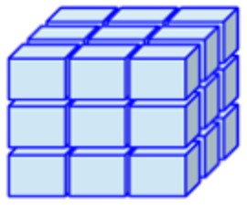

# Data Structures

## Data Types in R

In R, value has a *type*: 

| Data Type  | Examples|
| -----------:|:-------------------------------:|
| Integer (Numeric): | ..., -3, -2, -1, 0, +1, +2, +3, ... |
| Double (Numeric):  | most rational numbers; e.g., 1.0, 1.5, 20.0, pi|
| Character:  | `"a"`, `"b"`, `"word"`, `"hello dear friend, ..."`|
| Logical:  | `TRUE` or `FALSE` (or: `T` or `F` ) |
| Factor:  | Restricted, user-defined set of values, internally represented numerically (e.g., Gender {'male', 'female', 'other'}) |
| Ordered factor:  | Factor with an ordering (e.g., Starbucks coffee sizes {'venti' > 'grande' > 'tall'}) |


## Data Structures in R

- All values in R are organized in data structures. Structures differ in their number of dimensions and in whether they allow mixed data types. 

- In this course, we will mainly use vectors and data frames.

|        | dimensions    | types    |
| ------:|:-------------:|:--------:|:--------:|
| Vector | 1-dimensional | one type | {width=25%}
| Matrix | 2-dimensional | one type | {width=20%}
| Array  | n-dimensional | one type | {width=20%}
| Data frame (or tibble) | 2-dimensional | mixed types | {width=20%}
| List   | 1-dimensional | mixed types | {width=50%}
 <font size="1">(Illustrations from Gaurav Tiwari's article on medium [here](https://medium.com/@tiwarigaurav2512/r-data-types-847fffb01d5b).) </font>

- Let's look at some examples
```{r, error=T}
# create and print vectors, don't save
c(1,2, 1000)
c(1,2, 1000, pi)
1:3
```

```{r, error=T}
# create and print a data.frame
data.frame(1:3)
```

## Vectors

- Vectors are simply ordered lists of elements, where every element has the same type.
- They are useful for storing sets or sequences of numbers.
- Let's create a simple vector with all integers from 1 to 8 and look at its contents.

```{r, error=T}
vector_var <- c(1,2,3,4,5,6,7,8)
vector_var
```

- There is even a more elegant ways to do that: 
```{r, error=T}
vector_var <- 1:8
vector_var
```

- Now, let's create a simple vector with integers between 1 and 8, going in steps of 2.
```{r, error=T}
vector_var <- seq(1,8, by=2)
vector_var
```

- Some useful vectors already exist in R.
```{r, error=T}
letters
```
```{r, error=T}
LETTERS
```

- We can select specific elements of a vector by indexing it with `[]`.
```{r, error=T}
# the first letter
letters[1]
```

```{r, error=T}
# the 13-th letter
letters[13]
```

- Indices can be vectors too.
```{r, error=T}
# both of them
letters[c(1,7)]
```

- We can even take a whole *'slice'* of a vector.
```{r, error=T}
# both of them
letters[6:12]
```


- Indices can even be negative. A negative index $-n$ means *'everything' except $n$*.
```{r, error=T}
# both of them
letters[-1]
```

- Vectors can be named.
```{r, error=T}
digits <- c('one'=1, 'two'=2, 'three'=3, 'four'=4, 'five'=5, 'six'=6)
```

- In this case, we can index by the name
```{r, error=T}
digits[c('one', 'six')]
```


- Believe it or not, everything in R is actually a vector. For example `9` is a vector with only one element, which is `9`. 
```{r, error=T}
9
```

- This is why every output begins with `[1]`. R tries to help you find numbers in printed vectors. Every time a vector is printed, it reminds you at which position in the vector we are.
- The `[1]` in the output below tells you that `"a"` is the first element, and the `[20]` tells you that `"t"` is the 20-th element.

```{r, error=T}
letters # print a vector with all lower-case letters
```


### What are vectors good for?

- Let's put this knowledge to use.
- Here are two vectors representing the winnings from my recent gambling:
```{r}
horse_bets_payout_tl <- c(100, -50, 1, 100, -10, -20, 250, -40, -30, 23, -23, 55, 14, 8, 24, -3)
```
```{r}
poker_payout_tl <- c(24, 5, -38.1, 12, 103, 15, 5, 187, 13, -23, -45, 36)
```


- Let's find out which game is more profitable. 
- To get our average profit, we first need to compute the sum of a vector. 
- Then, we will divide the sum by the length of the vector.
- First, let's compute the sums of these vectors.

```{r, error=T}
sum(horse_bets_payout_tl)
sum(poker_payout_tl)
```

- Now, we need to determine the length of these vectors:

```{r, error=T}
length(horse_bets_payout_tl)
length(poker_payout_tl)
```

- Dividing the sum by the length would give us our average profit.

```{r, error=T}
sum(horse_bets_payout_tl)/length(horse_bets_payout_tl)
sum(poker_payout_tl)/length(poker_payout_tl)
```

... so which game is more profitable?

- It seems that betting is more profitable. 


- Next time, we can accomplish this calulation by calling the function `mean()`.

```{r, error=T}
mean(horse_bets_payout_tl)
mean(poker_payout_tl)
```


\ldots Now, I forgot to mention that my bookie charges me 1.5 TL per bet on a horse, on average. The poker payouts correspond to the profits, though. \ldots 

- Luckily, we can just add numbers and vectors. Let's just create two new vectors which contain the profits.

- Let's subtract 1.5 from elements of `horse_bets_payout_tl` and save the result as `horse_bets_profits_tl`.
- As you see, this subtraction is applied to every element of the vector. 

```{r, error=T}
horse_bets_profits_tl <- horse_bets_payout_tl - 1.5
head(horse_bets_profits_tl)
head(horse_bets_payout_tl)
```

- For poker, we don't need to change anything. So, we assign the already existing `poker_payout_tl` vector to another vector called `poker_profits_tl`. 

```{r, error=T}
poker_profits_tl <- poker_payout_tl
```

- Let's compare:
```{r, error=T}
horse_bets_payout_tl
horse_bets_profits_tl
```

```{r, error=T}
poker_payout_tl
poker_profits_tl
```


- Which game is more profitable now?

```{r, error=T}
mean(horse_bets_profits_tl)
```

```{r, error=T}
mean(poker_profits_tl)
```

## Data Frames

- What I forgot to mention is that I generally gamble on Wednesdays and Fridays. Maybe that matters?
- How can we associate this information with the profits vectors?

<!-- ```{r, error=T, eval=T} -->
<!-- length(horse_bets_profits_tl) -->
<!-- length(poker_payout_tl) -->
<!-- ``` -->

- One way is to represent it in two vectors containing days of the week. In that case, every $i$-th element in `poker_week_days` corresponds to the $i$-th element in `poker_week_days`.
```{r, error=T}
# create two vectors with week days
horse_bets_week_days <- rep(c("Wed", "Fr"), 8)
poker_week_days <- rep(c("Wed", "Fr"), 6)
```

- But this is getting messy. We have to keep track of two pairs a vectors, and the relations between them. Let's represent all poker-related information in one data structure, and all horse race-related information in another structure.

- The best way to represent a pair of vectors where the $i$-th element in vector 1 corresponds to the $i$-th element in vector 2 is with data frames. We can create a new data frame with the function `data.frame()`.
```{r, error=T}
df_horse_bets <- 
  data.frame(wday = horse_bets_week_days, 
             profit = horse_bets_profits_tl)
```
```{r, error=T}
df_poker <- 
  data.frame(wday = poker_week_days, 
             profit = poker_payout_tl)
```

- Let's take a look at what we've created.

```{r, error=T, eval=T}
df_horse_bets
```

- Wow. That's a rather long output ...

- Generally, it's sufficient to see the first couple of rows of a `data.frame` to get a sense of what it contains.
- We'll use the function `head()`, which takes a `data.frame` and a number $n$, and outputs the first $n$ lines.

```{r, error=T, eval=T}
# let's see the first two rows of the data frame called df_horse_bets
head(df_horse_bets, 2) 
```

- An alternative is `View()`, which shows you the entire `data.frame` within a new tab in the RStudio GUI.
```{r, error=T, eval=F}
View(df_poker)
```


- Turning back to our gambling example, we still have two objects, which really belong together. 

- Let's merge them into one long data frame.
- The function `rbind()` takes two data frames as its arguments, and returns a single concatenated data frame, where all the rows of the first data frame are on top, and all the rows of the second data frame are at the bottom.
```{r, error=T}
df_gambling <- rbind(df_horse_bets, df_poker)
```

<!-- to-do: Place all new functions info into little colored boxes, with an additional link to an online R man page.  -->

- Unfortunately, now, we don't have any information on which profits are from which game.
```{r, error=T}
head(df_gambling)
```

- Let's fix this problem by enriching both data frames with this information. 
- We can assign to new (or old) columns with our assignment operator `<-`.
- When we assign a value to a specific column, R puts the specified value into every row of the column of the given data frame.
- What the following code says is "Create a new column named `game` in the data frame named `df_horse_bets` and fill the column with the string _horse_bets_."

```{r, error=T}
df_horse_bets$game <- "horse_bets"
df_poker$game <- "poker"
```

- Now, let's bind them together again. (This overwrites the old data frame called `df_gambling`, which we created previously.)

```{r, error=T}
df_gambling <- rbind(df_horse_bets, df_poker)
head(df_gambling)
```

##  Working with data frames

- Now, we can do very cool things very easily.
- But we'll need two packages for that: `dplyr`, and `magrittr`.

```{r, error=T}
# load the two packages
library(magrittr) # for '%>%'
library(dplyr) # for group_by() and summarize()
```

- Now, we can *'aggregate'* data *(= "combine data from several measurements by replacing it by summary statistics")*.

- Let's compute the average profit by `game`.
- Within the `summarize()` function, we specify new columns. 
- In this case, `avg_profit` is the name of our column and its content is mean of the profit column.
- Keep in mind that `summarize()` function is applied at the group level. 

```{r, error=T}
df_gambling %>% 
  group_by(game) %>% 
  summarize(avg_profit = mean(profit))
```

- We can also aggregate over several grouping variables at the same time, like `game` and `wday`.

```{r, error=T}
df_gambling %>% 
  group_by(game, wday) %>% 
  summarize(avg_profit = mean(profit))
```

- ... and we can do so in various ways. Here we compute the proportion of wins. 

```{r, error=T}
df_gambling %>% 
  group_by(game, wday) %>% 
  summarize(avg_proportion_wins = mean(profit>0) )
```


- Now, we can also plot the results. 
- But we'll need to save the summary statistics first.

```{r, error=T}
profits_by_game <- 
  df_gambling %>% 
    group_by(game) %>% 
    summarize(avg_profit = mean(profit))
```

```{r, error=T}
profits_by_game_and_wday <- 
  df_gambling %>% 
    group_by(game, wday) %>% 
    summarize(avg_profit = mean(profit))
```

- We will also need yet another package (for plotting): `ggplot2`.

```{r, error=T}
library(ggplot2)
```

- After loading the package ggplot2, we can create plots with the function `ggplot()`. We will be going over the details in the upcoming chapters. 
<!--
- `ggplot()` takes the data frame and the `aes()` function as its arguments. 
- The `aes()` function is where we define what x and y axes are going to be. 
- Finally, we will give additional information that specify the general look of our plot with `+`.
- Let's first try a plot with points.
-->
```{r, error=T}
ggplot(profits_by_game, aes(game, avg_profit)) + geom_point()
```

- We may also want lines that connect the points.

```{r, error=T}
library(ggplot2)
ggplot(profits_by_game_and_wday, aes(game, avg_profit, color = wday, group = wday)) + geom_point() + geom_line()
```

- Or, we may want to have a bar graph.

```{r, error=T}
library(ggplot2)
ggplot(profits_by_game, aes(game, avg_profit)) + geom_bar(stat = "identity")
```

```{r, error=T}
library(ggplot2)
ggplot(profits_by_game_and_wday, aes(game, avg_profit, fill = wday)) + geom_bar(stat = "identity", position = "dodge")
```

<!-- 
- dollar sign
-->

## Functions in this section
`r function_definition("data.frame(a = x, b = y, ...)", "Create a data frame from several vectors. The vectors can be different types.", c(x="A vector with $n$ elements.", y="Another vector with $n$ elements.", "..."="More vectors can be provided."))`
<br>
`r function_definition("View(x)", "Display a data frame, or another structure.")`
<br>
`r function_definition("head(df, n=6)", "Show the first $n$ rows in the data frame df.", c(df="Data frame from which to display the first $n$ rows.", n="The number of rows to display. The default value for $n$ is 6."))`
<br>
`r function_definition("sum(x)", "Compute the sum of a vector.")`
<br>
`r function_definition("length(x)", "Return the length of a vector.")`
<br>
`r function_definition("mean(x)", "Compute the mean of a vector.")`
<br>
`r function_definition("rep(x, n)", "Repeat the contents of a vector $n$ times", c(x="The vector to be repeated.", n="How many times to repeat the vector x."))`
<br>
```{r results='asis', echo=F}  
function_definition_cat("seq(from, to, by)", 
                         "Create a sequence of integers from `from` to `to` in steps of `by`.",
                        c(from="The integer to start from.",
                          to="The integer to stop after.",
                          by="Size of steps to take. (If `from` $>$ `to`, `by` needs to be negative.)"))
```
<br>

`r function_definition("rbind(df1, df2)", "Append df1 to df2 and return the resulting data frame. Both data frames need to have the same number of columns with the same names.", c(df1="First data frame.", df2="Second data frame."))`
<br>