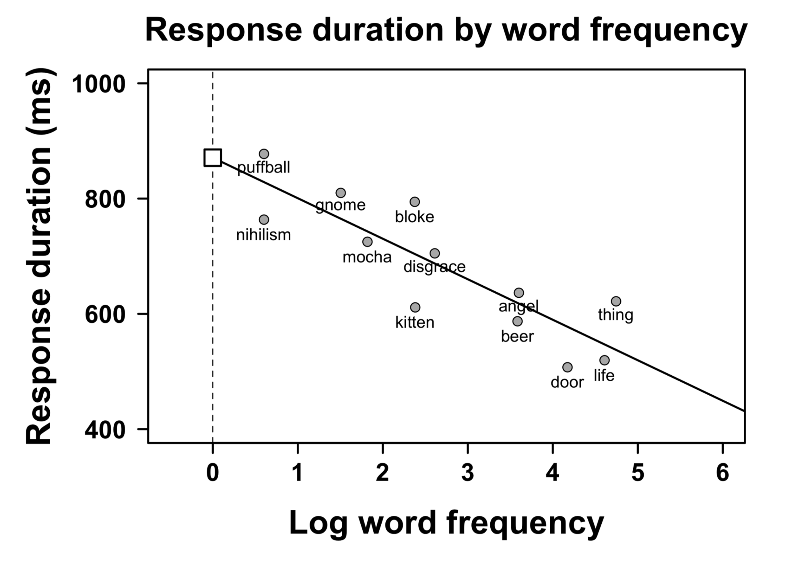
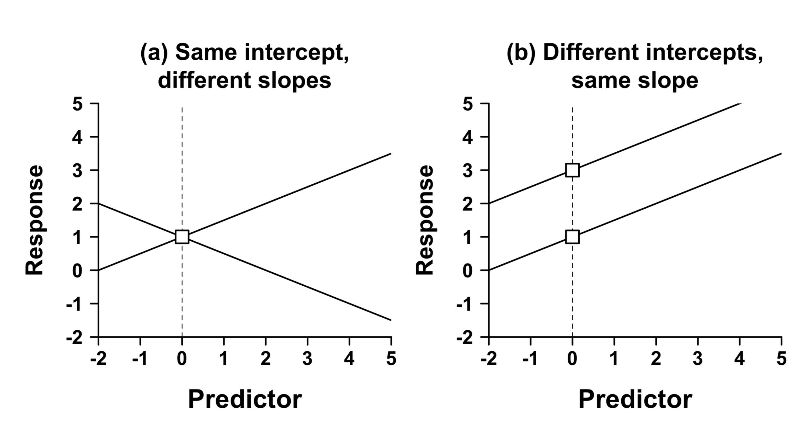

# Linear Regression with one Predictor

In the previous section, we looked at some descriptive statistics about data. In all of these cases, we looked at the descriptive statistics of a **single variable**. For example, we looked at the mean and standard deviation of total sleep hours for various animals. The variable we considered was `total_sleep_hours`. This is also called **univariate statistics** because we were interested in the statistics of a **single variable**.

Now, we are moving onto **bivariate statistics**. In other words, we will analyze the relationship between two variables. Instead of calculating the **mean** of a single variable, we will calculate the **conditional mean** of a variable based on some other variable. For example, we could try calculating the relationship between `total_sleep_hours` and `bodyweight`.

## Word Frequency Effects
Instead of looking at animal sleep hours, this time let's look at something more relevant for linguistics. Earlier, we discussed the role of frequency in processing. 

* Our hypothesis was that more frequent words will be processed more easily.
* We operationalized this hypothesis by picking
  *  **word frequency** as our **independent variable** (also called a **predictor**)
  * **reaction time** as our **dependent variable** (also called **response** or **outcome variable**)
  


The typical dataset we will be working with has a structure similar to the one below:

|dependent var.<br>($Y$) | predictor 1<br>($X_1$) | predictor 2<br>($X_2$)  | (other predictors) |
|-----|:----|:-----|:------|
|705  | 1.2 | 2.2  | (...) |
|209  | 8.3 | -4.0 | (...) |
|334  | 7.2 | -1.4 | (...) |
| ... | ... | ...  | (...) |

- What the variables represent will depend on the problem you're studying and the question you're asking
  * dependent variable (e.g., reaction time) 
  * predictor 1 (e.g., frequency) 
  * predictor 2 (e.g., familiarity) 
  
  
Let us take a look at a linear regression model where `x = frequency` and `y=response time`. 


```{r linearregression1, echo=FALSE, fig.cap="Response duration as a function of word frequency. The frequencies are not raw frequencies. Instead, log frequencies are used. We'll talk more about this."}


```

* Each point on the plot above indicates the average response time of multiple participants. 
* The somewhat diagonal line is called the **regression line**.

## Simple Linear Regression
In simple regression, our goal is to find the **regression line** as IT IS our model. The line extends to infinity and makes predictions about every point on its path. For example, our **model** can make a prediction about the reaction time if I were to find a word that has the log frequency 7. It would tell me that the reaction time would be a little below 400 miliseconds.

An important point regarding simple linear regression is that it can be used for data where the dependent variable is **continuous** (e.g. 436 miliseconds) but not **categorial** (e.g. grammatical/ungrammatical). 

## Finding the Regression Line

In simple linear regression, the value for a **dependent variable** is a **linear function of** the **predictor variable**. A linear function looks like the following.

$$y = a + b * x$$

Let us try to understand these values a bit. 

$$ \underbrace{Y}_{\text{dependent variable}} =
            \overbrace{\underbrace{a}_{\text{intercept}}}^{\text{additive term}} + 
            \overbrace{\underbrace{b}_{\text{slope}} * \underbrace{X}_{\text{predictor}}}^{\text{additive term}} $$

Mathematically, a line is defined in terms of an **intercept** and **slope**. 


* **Slope** can be defined as the amount of change in `y` as `x` changes one unit. 
$$ slope = \frac{\Delta y}{\Delta x}  $$
* A rising slope will have a positive value whereas a descending slope will have a positive value. 
* For example, the slope in the Response Duration Model above is -70. This means that for each unit of increase in frequency, we observe a 70ms decrease in reaction time. 

A slope is not enough to define a line on a plot. There can be an infinite number of lines that have the same slope. We also need the **intercept**. Intercept determines the value predicted for y when x is 0. Consider the following graphs. 

```{r interceptslope, echo=FALSE, fig.cap="Lines with different intercept and slope values."}


``` 

The intercept for the data Response Duration Model above is 880ms. So, our Response Duration Model is:

$$response\ duration = 880ms + (-70 \frac{ms}{freq}) * word\ frequecny   $$

A good way to remember the intercept and the slope and a linear model is to remember the **taxi fares**. The taxi fares will usually start with a constant fee (a minimum fee). This is your intercept. It's the 0th kilometers and it already costs you 7 TLs. Then the cost for each kilometer is your slope. At the time of writing these notes, it is 6TLs. 


```{r}
library(ggplot2)

distance = 1:20
cost = 20+(14*distance)

ggplot(data=NULL, aes(distance,cost)) +
  scale_x_continuous(breaks = seq(0, 20, by =1)) +
  scale_y_continuous(breaks = seq(0, 500, by = 20)) + 
  geom_smooth(method="lm", formula =y~x + I(20+14*x))

```

**Slope** and **intercept** are the **coefficients** of our linear regression model. Our task is to find the **coefficients** from the data.

## Estimating the Coefficients
A Linear Regression analysis of a particular data is essentially all about **estimating coefficients** and **interpreting the results**. In the **taxi model**, we already knew the coefficients. So, we had a model about the world and we can use the model to make predictions about taxi costs. In the Response Duration Model, the coefficients were learnt from the data but I gave them to you directly. So, how are we going to estimate the coefficients when what we have is just data but nothing else? 


Let's not get into the weeds of how to find the right linear regression model. Instead, let's just use R to estimate the coefficients. This is called **fitting a model**. So, let's fit a linear model on the taxi model and interpret its results. We'll start with the taxi model simply because we already know the coefficients. We'll let R estimate some coefficients for us and then compare them with the coefficients we used to generate the `cost` data above from the `distance` variables and our coefficients. 

The simplest way to fit a linear model on some data is the `lm()` function. `lm()` takes two variables `x` (predictor) and `y` (dependent variable) and fits a model by modeling `y` as a linear function of `x`. The tilde `~` means: element on the left as a function of element on the right. 

For our taxi model, we will model cost as a function of duration. The following lines of code does that. 

```{r}
# fit a linear regression model of cost as a function of distance
taxi_model <- lm(cost ~ distance)

# print the model coefficients
taxi_model
```
**Unbelievable!** The model estimated the intercept (start cost) as 20 and the slope (cost per km) as 14. Simple as that. Notice that the model estimated these coefficients simply from the data but nothing else. 


The model object that we stored in the variable `taxi_model` has a lot more information. Let us take a look at the results of our model. To do this, we'll take use the `glance()` function from the `broom` package. 
```{r}
library(broom)
library(tidyverse)
glance(taxi_model)
```

There are a lot of details. For now, we'll focus on only two values **R<sup>2</sup>** and the **p value**. 

```{r}
results <- glance(taxi_model) %>%
  select(r.squared, p.value)

results
```

Without going into any detail yet, I can tell you that we got an excellent model. Our **R<sup>2</sup>** is 1, which is perfect and our p value is very small `1.51e-287` (This means that there are 286 zeroes after 0. and before 151. So, a very small number). When the p value is so small, we can conclude that the relation between distance and cost is **statistically significant** (i.e. not random).  

## Data is messy
In the taxi model above, we worked with a very simplistic and ideal dataset. We know that in theory that is what a tax fare should look like. However, İstanbul is a crowded city and there are lots of traffic jams and traffic is quite unpredictable as there are so many random variables. Since the taxi charges you not only for the distance but also the duration you wait at the lights, there is always going to be some random addition to the fare. Let us incorporate that randomness to our taxi cost data and rerun our model to see what it looks like. 


All we are going to do is to add some random values to our taxi prices. Let's generate some random numbers and bind it to a new cost variable. 

```{r}
set.seed(42)
hidden_cost <- rnorm(20, mean=7.5, sd=4.5)
total_cost <- cost + hidden_cost
```

Let us plot the theoretical costs and the total costs side by side. We'll use the `gridExtra` package to plot two plots side by side. 

```{r}
library(gridExtra)

plot1 <- ggplot(data=NULL, aes(distance,cost)) +
  scale_x_continuous(breaks = seq(0, 20, by =1)) +
  scale_y_continuous(breaks = seq(0, 500, by = 20)) + 
  geom_smooth(method="lm") +
  geom_point() +
  ggtitle("Taxi cost without traffic")

plot2 <- ggplot(data=NULL, aes(distance,total_cost)) +
  scale_x_continuous(breaks = seq(0, 20, by =1)) +
  scale_y_continuous(breaks = seq(0, 500, by = 20)) + 
  geom_smooth(method="lm")+
  geom_point()+
  ggtitle("Taxi cost with traffic")

grid.arrange(plot1, plot2, ncol=2)


```

OK, now it looks like we have some more realistic data. Let us rerun our linear model to see what the coefficients look like. 

```{r}
better_taxi_model <- lm(total_cost~distance)

better_taxi_model
```
Notice that we got a new intercept and slope. It's kinda weird. We know that the taxi start fare is 20TL. However, our intercept is a lot higher (this will differ as each time you run your code as the traffic cost we calculated is random unless you set some seed number to generate the random values). This is quite off given our original intercept. 

Notice that the slope is a little off too. It's not exactly 14 but it's not way off like the intercept. So, did our linear model do well? Before answering this question more formally, I'll draw your attention to one point. Our model predicts that your initial taxi fare will be a little higher at the beginning and it will sort of even out as your distance increases. Even though our model doesn't guess the intercept correctly, it still does a very decent job in modeling the real life taxi costs (or a simulation of it). Just add up the intercept and slope and that should give you around the minimum cost you'll pay for a taxi ride.

```{r}
coef(better_taxi_model)[1] + coef(better_taxi_model)[2]
```

At this point, I want to remind you that taxi rides in İstanbul have a minimum of 70 TLs for short distance trips (2km or less). So, our model does pretty good for a real life scenario. 

## Simplified Frequency Data
Let us use a simple frequency data. Go ahead and download the `log10ELP_frequency.csv` file from Moodle. This is the same data in Bodo Winter's ELP_frequency.csv file with an added column for log10 normalization. We will plot the data using a scatterplot with geom_point and also draw a regression line. 

We will use log normal values as the x axis and the reaction time as the y axis. 


```{r}
library(ggrepel)


freq_data <- read_csv("/Users/umit/ling_411/data/log10ELP_frequency.csv")


ggplot(freq_data, aes(x=log10freq, y=RT)) +
  scale_x_continuous(limits = c(0,5)) +
  geom_text_repel(aes(label = Word)) +
  geom_point()+
  geom_smooth(method="lm",se=F)

freq_model <- lm(freq_data$RT ~ freq_data$log10freq)

```


OK, let us also get a glace at our model. We'll first take a look at the slope and the intercept and then **R<sup>2</sup>** and the **p value**. 


```{r}
coef(freq_model)
```

```{r}
glance(freq_model)
```


## Residuals 
So far, we built and plotted linear models by estimating the intercept and slope of a line that seems to best describe our data. In the simple taxi model, we were in a perfect position. Our model had a **perfect fit** on our data. However, once we introduced some **random noise** (e.g. random traffic jams) into our data, our linear model still did a decent job but it was not a perfect fit. 

Next, we tried modeling the simple frequency data and we got a decent model that describes the trend in our data but the fit is not perfect. Can we find a way to quantify how good our model fits our data ("goodness of fit"). That's what we will do here. Let us reconsider the frequency data plot. This time, we'll draw lines from the data points to the regression line. The distance for each data point is called a **residual**. It describes the amount by which our model missed the actual value. 


```{r}
freq_model <- lm(freq_data$RT ~ freq_data$log10freq)
ggplot(freq_data, aes(x=log10freq, y=RT)) +
  scale_x_continuous(limits = c(0,5)) +
  geom_text_repel(aes(label = Word)) +
  geom_point()+
  geom_smooth(method="lm",se=F)+
  geom_segment(aes(x = log10freq, y = RT,
                   xend = log10freq, yend = fitted(freq_model)))
```


```{r}

ggplot(freq_data, aes(x=log10freq, y=RT)) +
  scale_x_continuous(limits = c(0,5)) +
  geom_text_repel(aes(label = Word)) +
  geom_point()+
  geom_hline(yintercept = 680)+
  geom_segment(aes(x = log10freq, y = RT,
                   xend = log10freq, yend = 680))
```

Now, we have two models:

* A  model where there is a relation between frequency and reaction time
* A null model where there is no relation between frequency and reaction time (reaction time is independent of frequency)

### Sum of Squared Errors
One way to describe the errors of the model is to sum the squares of each error value. This is called the Sum of Squared Errors.

To do this, we need to get the residuals of the model, square them and then sum them. Let us do this for the linear model.

```{r}
SSE_freq_model <- sum((residuals(freq_model))^2)
SSE_freq_model
```

Let us also calculate it for the null model. The intercept for the null model was 680 I found this value by taking the average reaction time. This will be my null model. The mean was 679.9167. So, we'll deduce the the mean from the actual values to find the residuals. The rest is just the same. 

```{r}
null_model_residuals <- freq_data$RT - 680
SSE_null_model <- sum(null_model_residuals^2)
SSE_null_model
```


These numbers are very similar to what Bodo Winter reports in his chapter. He might not have done the rounding I did. We use the null model to calculate a **standardized measure of fit**. One measure is **R<sup>2</sup>** and it is calculated as follows.

$$R^2 = 1 - \frac{SSE_{model}}{SSE_{null}} $$
Let's calculate **R<sup>2</sup>**.

```{r}
r_squared <- 1 - (SSE_freq_model/SSE_null_model)

r_squared
```


**Excellent!** We've calculated **R<sup>2</sup>** and it is the same as what we found earlier when we took at a look at the model report using the `glance()` function. 

So, what is this **R<sup>2</sup>**? When we interpret **R<sup>2</sup>**, we say "n" amount of the variance in the dependent variable (RT) can be accounted for by incorporating the independent variable (word frequency). In this case, 73% of the variance is due to word frequency. The remaining 27% is due to chance or some other factors we didn't consider. 


