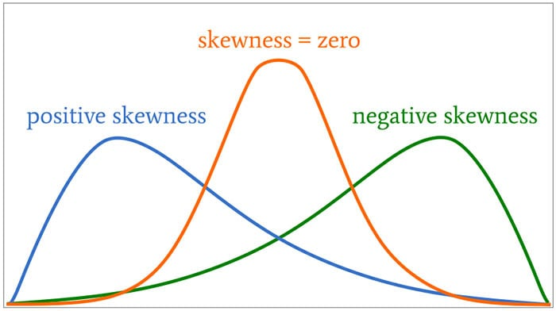

# Linear & Non-Linear Transformations
## Linear Transformations
A **linear transformation** of a value is addition, subtraction, multiplication, or division with a constant value. Consider the following data:

* [2, 4, 6, 8]

Each of the number on the right is 2 more than the number on the left. Adding 1 to each of the values is a linear transformation of this data.

* [3, 5, 7, 9]

While the numbers themselves change, the relationship among them does not. 

Linear transformations are especially useful in describing data at a level of measurement that is useful to you. For example, the following descriptions are equal and they are linear transformations of each other. 

|**Measured Value**| **Metric 1** | **Metric 2**  | 
|:-----|:----|:-----|
| Distance  | 700m | 0.7km |
| Time | 2100ms | 2.1s |

The crucial point in linear transformations is that they won't change the relationship among your data point and thus won't impact your models significantly. There are many different types of linear transformations. For our purposes we will focus on two linear transformations **centering** and **standardizing**. 

### Centering
Let us consider one of our previous examples. 

```{r message=FALSE}
library(tidyverse)
library(ggrepel)

```


```{r message=FALSE}
freq_data <- read_csv("/Users/umit/ling_411/data/log10ELP_frequency.csv")

ggplot(freq_data, aes(x=log10freq, y=RT)) +
  scale_x_continuous(limits = c(0,5)) +
  geom_text_repel(aes(label = Word)) +
  geom_point()+
  geom_smooth(method="lm",se=F, fullrange=TRUE)+
  geom_vline(xintercept = 0, linetype = "dashed")+
  geom_label(data=NULL, aes(x=0, y= 870, label="870"))
```

Overall, our model does a decent job in showing us that there is a trend in our data. As the frequency of a word increases, reaction time decreases. However, the model also makes some hard to interpret prediction. Our model predicts that when the frequency of a word is 0, RT is expected to be 870. But that's kinda odd. What does it mean for a word to have 0 frequency. If a word has 0 frequency, does it even exist? 

At this point, we can step back and ask ourselves a question regarding the **intercept**. When we defined the intercept, we defined it as the value y takes when x is 0. We mentioned that this was the way to define a line mathematically. But why x=0? 

Maybe setting the intercept as the value y takes when x=0 is mathematically meaningful. We can assume that x=0 is the **center** of the positive and negative integers both of which go to infinity.  However, our data are usually finite and their center is usually not 0. We have talked about various measures of **central tendency** to identify the center of our data (e.g. mean, median, mode). How about we take the **mean** as the center of our data. In other words, how about we take the mean to be our x=0 point? This is called **centering**. 

When you **center** your data, your intercept becomes the value y assumes when x = mean(x). Thus, everything is interpreted relative to the mean. In other words, instead of measuring the distance from the absolute 0, we measure the distance from the mean. 

**To center a predictor variable**, we subtract the mean from each of the predictor variables. Let us center the log frequency data and plot it again. 

```{r}
centered_freq_data <- mutate(freq_data, centered_log_freq = log10freq - mean(log10freq))

centered_freq_data
```

We can see that the centered data has smaller values compared to the log frequencies. We also observe that there are negative values. What does a negative value mean? How can the frequency of a word be negative? In this case, the negative value is relative to the mean. Thus, it means that it is less than the mean (but still above 0).

```{r message=FALSE}

ggplot(centered_freq_data, aes(x=centered_log_freq, y=RT)) +
  scale_x_continuous(limits = c(-3,3), n.breaks=6) +
  geom_text_repel(aes(label = Word)) +
  geom_point()+
  geom_smooth(method="lm",se=F, fullrange=TRUE)+
  geom_vline(xintercept = 0, linetype = "dashed")+
  geom_label(data=NULL, aes(x=mean(centered_log_freq), y= 675, label="680"))
```

Let us take a look at the intercept and slope values of the two models as well as their **R<sup>2</sup>** values to see if centering has any effect on the model and its interpretation. 

```{r echo=FALSE, message=FALSE, warning=FALSE}
library(broom)
uncentered_model <- lm(freq_data$RT~freq_data$log10freq)
centered_model <- lm(centered_freq_data$RT ~centered_freq_data$centered_log_freq)


tidy(coefficients(uncentered_model))
tidy(coefficients(centered_model))

glance(uncentered_model)$r.squared
glance(centered_model)$r.squared

```

You can see that both the slope and the **R<sup>2</sup>** values remain unchanged. This shows that the model is remaining the same in all the crucial aspects except that it's now treating its 0 point as the mean. This is more meaningful for most measurements. In addition, centering helps interpreting the coefficients especially when multiple predictors interact (to be discussed later). 

### Standardizing
The second type of linear transformation that is very common is **standardizing** a.k.a. **z-scoring**.  Standardizing also helps identifying a **standard scale** that helps us define a metric in terms of the sample mean and standard deviation. This is a little counter-intuitive but helps a lot especially when we are interpreting models with multiple predictor variables. 

Imagine that you have your taxi data set with the fare and distance variables. One very basic question you have to answer is what metric to use to report the distance. Should you use kilometers, miles, yards, meters, etc. Now, further imagine that you're comparing two data sets with different reported distance measures (e.g. mile vs km). This is actually a relatively simple problem as you can transform miles to kms and vice versa. However, what if you are trying to measure the relative impact of distance and the number of bridges you pass. These are two different variables with two different measurement units. We cannot directly compare kilometers with the number of bridges. They're not on the same scale. Standardizing helps us make such comparisons (sometimes).

To standardize a variable, we divide the centered values by the standard deviation of the (sample) values. 

```{r}
centered_freq_data <- mutate(centered_freq_data, z_log_freq = centered_log_freq/sd(log10freq))

centered_freq_data
```

Let us plot a histogram of z scores to see what they look like. 

```{r message=FALSE}
ggplot(centered_freq_data, aes(z_log_freq)) +
    scale_x_continuous(limits = c(-3,3), n.breaks=6)+
        geom_histogram(binwidth=0.1,
                       color = 'black',
                       fill = 'lightblue')
```


## Scaling and Standardizing in R
In the previous sections, we calculated the centered values and the standardized values by hand. R has a dedicated function `scale()`  which does both. 

```{r message=FALSE}
library(tidyverse)
cab_fares <- read_csv('data/cab_fares.csv')
cab_fares

# only centering
cab_fares <- mutate(cab_fares, distance_c = scale(distance_km, scale = FALSE))

# centering and standardizing
cab_fares <- mutate(cab_fares, distance_c_z = scale(distance_km))

#printing the dataframe
cab_fares
```

Let us plot a histogram of the raw, centered and the z_scored data. 

```{r message=FALSE}
library(gridExtra)
ggplot(cab_fares, aes(distance_km)) +
        scale_x_continuous(limits = c(0, 25), n.breaks=10)+
        geom_histogram(binwidth=0.3,boundary=0,
                       color = 'black',
                       fill = 'lightblue')

ggplot(cab_fares, aes(distance_c)) +
        scale_x_continuous(limits = c(-10, 10), n.breaks=10)+
        geom_histogram(binwidth=0.3,boundary=0,
                       color = 'black',
                       fill = 'lightblue')


ggplot(cab_fares, aes(distance_c_z)) +
        scale_x_continuous(limits = c(-4, 4), n.breaks=10)+
        geom_histogram(binwidth=0.1,boundary=0,
                       color = 'black',
                       fill = 'lightblue')


```

**Important** A z-score above 3 or below -3 is usually interpreted as an extreme value. 

## Non-linear Transformations

### Logarithms & Log Transformation
One of the problems we often face in raw data is **skewness**. Technically, skewness is a measure of asymmetry in the data. In practice, it looks like the bulk of the data is rested on one side of a histogram plot with a long tail on the other side. When the tail of the data extends towards a positive value, data is **positively skewed**. When the tail extends towards a negative value, we call it **negatively skewed**.

```{r skewness, echo=FALSE, fig.cap="Skewness. Image by [Robert Keim](https://www.allaboutcircuits.com/technical-articles/understanding-the-normal-distribution-parametric-tests-skewness-and-kurtosis/)"}

```

Many types of data in linguistics have a positive skew. For example, frequency data is highly skewed. Let us take a look at a frequency data for 50K words from Turkish. (I got this data from some corpus but I don't remember where. Apologies for not being able to provide credit.)

```{r}
turkish_freq <- read_csv("data/tr_50k_freq.csv", col_names = c("word", "frequency"))

turkish_freq
```

Let us now get a histogram to see what the data distribution looks like. 


```{r message=FALSE}
ggplot(turkish_freq, aes(frequency)) +
  scale_x_continuous(limits = c(0100, 10000), n.breaks=10)+
  geom_histogram(bins=150,
                 color = 'black',
                 fill = 'lightblue')+
  geom_vline(xintercept = mean(turkish_freq$frequency), linetype="dashed" )
```

It looks like most of the words are quite infrequent and a handful of words are very frequent. In fact, word frequencies are skewed in a very interesting way and they have a special distribution name called **Zipfian** distribution named after George Kingsley Zipf. But we're not interested in that for now. 

The important point to notice is where the mean is in this distribution. The mean is shown with the dashed line and it does not in any way reflect the majority of the data. What is more important is that when the data is skewed, its linear modeling will usually result in **residuals that are not normal**. If the residuals are not normal, then the model will lose its validity. It is important that you notice what matters is the **normality of the residuals**  not the normality of the data. Non-normal data is still fine for liner models as long as the residuals are normal. 

**So, what are logarithms and how do they help?**

Logarithms are inverses of exponentiation. 

|**Logatihm**| **Exponentiation** | 
|:-----|:----|:-----|
| log<sub>10</sub>(1) =0 | 10<sup>0</sup> = 1 |
| log<sub>10</sub>(10) =1 | 10<sup>1</sup> = 10 |
| log<sub>10</sub>(100) =2 | 10<sup>2</sup> = 100 |
| log<sub>10</sub>(1000) =3 | 10<sup>3</sup> = 1000 |
| log<sub>10</sub>(10000) =4 | 10<sup>4</sup> = 10000 |

Transforming the data into a log space has a very interesting normalizing impact on your data. It shrinks your data in a non-linear fashion by reducing smaller numbers less than the big numbers. Consider the following example. 


|**Raw Value**| **log<sub>10</sub> Value** | **Difference**  | **% Shrunk**  | 
|:----|:----|:----| :----| 
| 10 | 1 | 9 |90% |
| 100 | 2 | 98 | 98% |
| 1000 | 3 | 997 | 99.7% |


Log transformation keeps some of the relation among data points but removes a decent bit of information as well. When we log transform our data, it becomes **more normal** and **less skewed**. It doesn't always become completely normal but it is more normal. 

Let us log<sub>10</sub> transform the frequency data for Turkish and plot a histogram to see what the data looks like now. 

```{r message=FALSE, warning=FALSE}
# create a new column with the log10 frequency values
turkish_freq <- mutate(turkish_freq, log10freq = log10(frequency))


#plot a histogram of the log10 frequency values
ggplot(turkish_freq, aes(log10freq)) +
  scale_x_continuous(limits = c(0, 8), n.breaks=8)+
  geom_histogram(bins=150,
                 color = 'black',
                 fill = 'lightblue')+
  geom_vline(xintercept = mean(turkish_freq$log10freq), linetype="dashed" )
```


Notice that the data is still skewed but it's not as bad as before and the mean is closer to the bulk of the data. 

### Linear Regression with Log Transformation

You should run a linear model with and without log transformation to see how the model performs. You can do that by looking at various values. 

* SSE
* R<sup>2</sup>
* p value

You can also fit a linear regression plot against a point plot to see how they differ. Let us do this for the `log10ELP_frequency` data. It's the smaller dataset. You should also consider log10 transforming your dependent variable as well.
