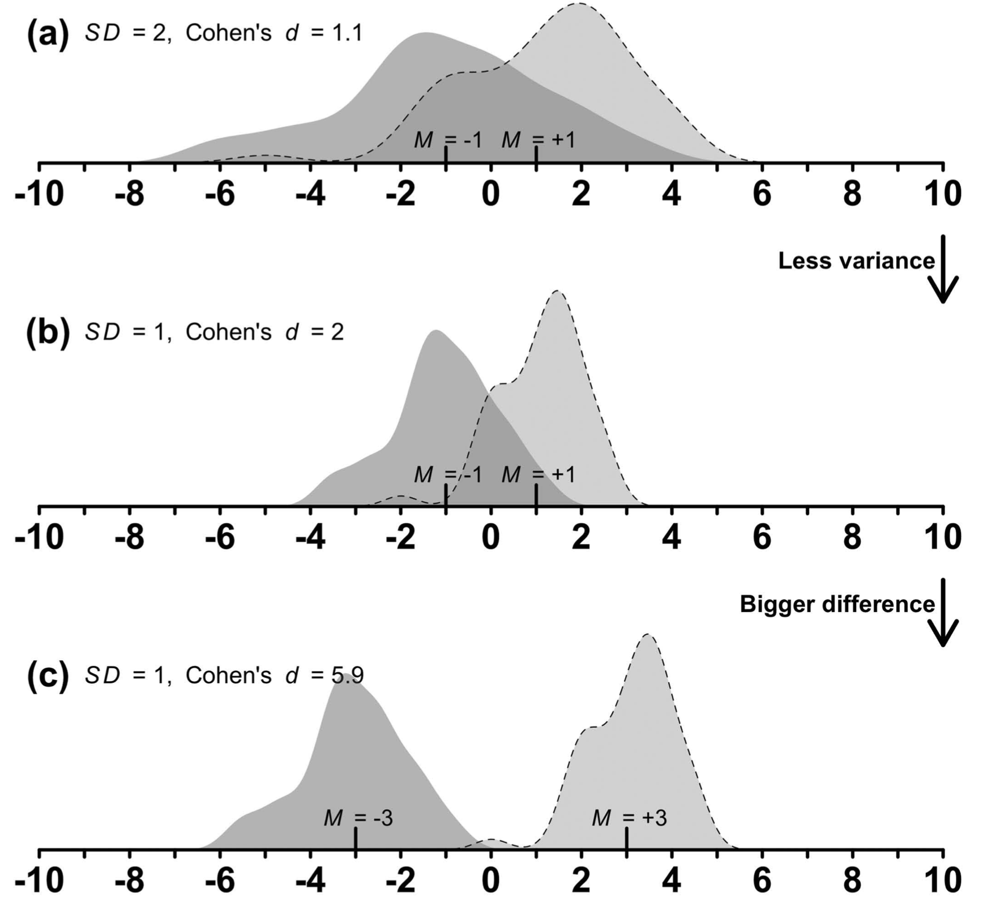

# Effect Size & Significance
Often times, we will observe a difference between the means of two groups. These groups could be variables of any factor. For example, age could be a factor an we could be investigating the difference in voice pitch between children and adults. Or, we could be looking at the difference between the frequency of using the word **darlamak** between members of Gen X and Gen Z. Yet another example would be looking at the difference between the average valence of smell and taste words.

In all these cases, we are comparing two means. So, let's say we collect data from 100 adults and 100 children and observe that on average children's fundamental frequencies in their voice pitch is 100Hz higher than those of adults. 

What have we found? Is this a big difference? (As humans we are usually able to distinguish between and adult and a child when they speak. So, assuming that fundamental frequency is a predictor of adult vs child, then we know that some level of difference in Hertz is the source of this difference. But what is that level?)

Let's say we run another experiment with five children and 5 adults. Now, we find the average difference to be 200. So, once again, we face the same question. Is 100 big? Is 200 big? Obviously 200 is bigger than 100 but we don't know if these are big numbers or not. 

Once again, we need to think of magnitude not in terms of absolute values but relative to a population (e.g. humans, children, adults, men, women, etc.). So, it would be great if we could figure out a way to calculate the **effect size** of a predictor (e.g. being adult or being a child) in a **standardized way**. If we have a standard definition of effect size, then we can compute this for any kind of metric.

As we are trying to figure out a standardized effect size (and other values), we'll keep three main points in mind:

* **Magnitude of difference**
  * The bigger the difference between (means of) two sample groups, the more you should expect to see a difference in the population. 
  
* **Variability in the data**
  * The less variability in the data, the more certain you'll be about the estimate. 
  
* **Sample Size**
  * The bigger the sample size, the more accurate is your measurement of the difference.


## Cohen's *d*
Cohen's *d* is the measure used to quantify the **strength** of a difference between two means (m1 and m2). The formula for Cohen's *d* is given below:

$$d = \frac{m1-m2}{s}$$

* m1 = mean of group 1
* m2 mean of group 2
* s = standard deviation of all the data (group 1 and group 2)


Let us try Cohen's *d* for the Smell and Taste data. 


First, load the data and select the relevant data using the filter function. 
```{r message=FALSE}
#Import tidyverse
library(tidyverse)
#Read in the data
data <- read_csv('data/winter_2016_senses_valence.csv')
#print the head to see what it looks like
senses_data <- filter(data, Modality %in% c('Taste', 'Smell'))
data
```

Let us get the means for each category. 

```{r}
means <- senses_data %>% 
  group_by(Modality) %>% 
  summarize(avg = mean(Val))
```

Now we can calculate Cohen's *d*.

```{r}
d = (means$avg[1] - means$avg[2]) / sd(senses_data$Val)
d
```

We can also use the package `effsize' to calculate Cohen's d. You'll see observe a difference between our calculation and the calculation given by the effsize packgae. This is mainly because they use a slightly difference way of calculating variation in the data (the denominator). That's not a huge difference. 

```{r}
library(effsize)
cohen.d(Val ~ Modality, data = senses_data)
```

How to interpret Cohen's d?

|**Cohen's *d* **| **Magnitude** | 
|:--|:--|
| \|0.2\| | small | 
| \|0.5\| | medium | 
| \|0.8\| | large | 


```{r cohens, echo=FALSE, fig.cap="Cohen's *d*."}

```

## Standard Error
Cohen's *d* is a standard measure of difference in magnitude between two samples. It does not care about the sample size though. Your sample size for each group could be 2, 200,2K, 2M. 

Although, Cohen's *d* can tell us whether the difference between the two samples is large, it won't tell us much about our population. 

Here's a small example. I want to test if there is a difference between the voice pitch of people who wear blue shirts and people who wear red shirts. Assume that the following is my data. 

|**Participant (by shirt color) **| **Fudnamental Frequency** | 
|:--|:--|
| Blue 1 | 175 | 
| Blue 2 | 75 | 
| Red 1 | 312 | 
| Red 2 | 190 | 


Let us run Cohen's d on this data to see what the magnitude of the difference is. 

```{r}
blue = c(175,75)
red = c(312,190)
mean(blue) -mean(red)
cohen.d(blue,red)
```

We get a large effect. However, there's no way we can conclude that shirt color has anything to do with someone's voice pitch. We cannot generalize to the population. We observe a difference but we probably have a decent error margin in our prediction. To quantify this error, we need to introduce a new mertric **standard error**.

## Standard Error
Standard Error (SE) is a combination of the **variability** in the data and the **sample size**

$$SE = \frac{s}{\sqrt{N}}$$

* s = standard deviation
* N = sample size

The bigger the standard error, the less accurate is your estimation of the population parameters. This means your estimation (of the parameters, i.e. mean and standard deviation) is less reliable. The smaller the SE, the more accurate is your calculation of the population parameter estimates. 

As you can see from the formula:

* SE will increase as your standard deviation grows (i.e. there is more variance in the data)
* SE will decrease as your sample size grows


Let's calculate the standard error for the little sample above. First we need to find s (which is the pooled standard deviation of the two groups.) The formula is 

$$s = \sqrt{\frac{sd1 + sd2}{2}}$$

```{r}
s <-  sqrt(((sd(blue)**2)+(sd(red)**2))/2)
s
```
Now, we can calculate the standard error for the difference of the two means. 

```{r}
SE <- s / sqrt(4)
SE  
```

Standard Error tells us how close or far away from the true population mean. In this simple example, we were trying to get the difference in average voice pitch between blue and red shirt wearers. We have a total of 4 data points. This is obviously going to return a big standard error. 


## Confidence Interval

Confidence interval is going to help us answer the following question. Confidence interval is a metric that helps you determine the level of confidence in your population parameter estimates. For example 95% confidence interval means the following. 

If I were to sample this data (2 blue, 2 red) 100 times. 95 times, the difference in their means would lay between two numbers (x and y). The smaller this interval, the better. 

The confidence interal formula for 95% is as follows:

$$CI = [mean - 1.96*SE,mean + 1.96*SE ]$$

As the name suggests, CI is an interval and the numbers returned define the range of possible values for 95% of the time. 

Let us calculate the 95% confidence interval for our mean difference for blue and red data. 

```{r}
mean_diff <- mean(red) - mean(blue)

CI <- c(mean_diff - (1.96*SE), mean_diff + (1.96*SE))
CI
```
