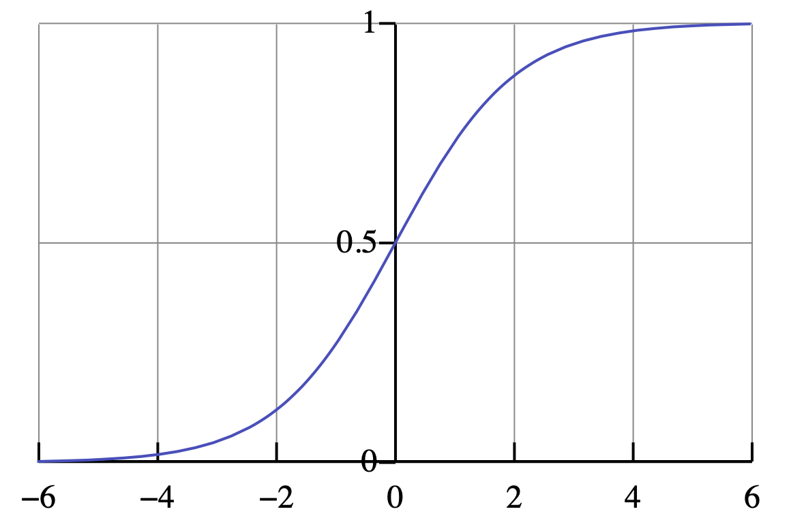

# Logistic Regression
So far, we built linear models where the outcome (i.e. dependent variable) was a continuous value (e.g. reaction time, frequency, etc.). Now, we turn to modeling data where the outcome is a **categorial** value. In particular, we will use **logistic regression** to model **categorical** outcomes where the number of categories is **two**. Some examples are:

* acceptable -- unacceptable expression
* NP NP construction -- NP PP construction
* SOV -- SVO word order
* accusative present -- accusative absent
* adult -- child

For example, we can use **average utterance length** as an indicator of **child speech** vs. **adult speech**. Consider the following artificial toy dataset.

|**Utterance length **| **Utterer** | 
|:--|:--|
| 2 | child | 
| 8 | adult | 
| 12 | adult | 
| 3 | adult | 
| 3 | child | 
| 6 | adult | 
| **5** | **???** | 

**Given the data set above, can we predict whether it was uttered by a child or an adult?**

Notice that the answer is not that straightforward as it is possible that the utterance belongs to a child because it is shortish but on the other hand, we do see that the adults also produce short sentences (e.g. utterance length of 3).


## The Intuition
The core intuition behind logistic regression is very simple. The task is to **model the probability of an outcome given a predictor**. Going back to our toy example above, we would like a model that can produce probabilities like the following. 

* $p(child | length = 5)$
  * read as *probability of the utterer being a child given that the utterance length is 5*
  <br>\
* $p(adult | length = 5)$
  * read as *probability of the utterer being an adult given that the utterance length is 5*
  
For example, we want to build a model that returns something like the following. 
  
```{r message=FALSE, echo=FALSE}
 
library(ggplot2)
data <- data.frame(outcome = c(0, 1), probability = c(0.8, 0.2))

ggplot(data, aes(x = factor(outcome), y = probability)) +
  geom_bar(stat = "identity", fill = "steelblue", color = "black",width = 0.3) +
  labs(title = "Probability of the utterance with length 5",
       x = "Outcome",
       y = "Probability") +
  scale_x_discrete(labels = c("Child", "Adult")) +
  theme(axis.title = element_text(size = 16))+
  theme(plot.title = element_text(size = 20))+
  theme(axis.text = element_text(size = 14)) 
``` 
  
Once we estimate the probabilities, we have a model that can:

* **predict** the categorical outcome (e.g. adult vs. child)
* help us **interpret** the relationship between a predictor and the outcome

Let us now turn to the math behind how the logistic regression works.

## The Math
Remember that our **linear regression** models assumed that our data is **normally distributed**. Normal distribution is a distribution of continuous values. Similarly, for **logistic regression**, we assume that the **outcome variables** come from a certain probability distribution. 

### Binomial & Bernoulli Distributions
#### Binomial Distribution
The **Binomial Distribution** is a discrete probability distribution with a fixed number of **Bernoulli trials** with the parameters:

* $n$ trials
* $p$ probability

where each trial has only two possible outcomes: **success** or **failure**. Success can be associated with any outcome that is relevant to you as long as there are only two outomes. For example:

* success = child -- failure = adult
* success = acceptable -- failure = unacceptable
* success = SVO -- failure = SOV
* ...


A good way of understanding the binomial distribution is to think of a coin-flip experiment. Imagine that you have a fair coin and you flip the coin 10 times. What is the probability that you will have 5 heads (i.e. successes)?


```{r echo=FALSE}
# Define parameters
n <- 10 # Number of trials
p <- 0.5 # Probability of success

# Calculate probabilities for each number of successes
x <- 0:n # Possible number of successes
y <- dbinom(x, size = n, prob = p) # Probability for each possible success

# Create and customize the plot
plot(x, y, type = "h", main = "Binomial Distribution (n=10, p=0.5)",
     xlab = "Number of successes", ylab = "Probability", lwd = 5, col = "blue")

```

To get the actual probability values in R, we can use the ```dbinom()``` function.

```{r}
n = 10 #number of trials
p = 0.5 #probability of success (e.g. heads)
s = 5 #number of successes in n trails (e.g. number of heads in 10 trials)

dbinom(s,n,p)

```

Try it with different parameters to see how the probabilites change.

Notice that the binomial distribution is a discrete distribution (not continuous) but the plot looks very similar to a normal distribution especially when the number of trials is at or above 30.

```{r echo=FALSE}
# Define parameters
n <- 30 # Number of trials
p <- 0.5 # Probability of success

# Calculate probabilities for each number of successes
x <- 0:n # Possible number of successes
y <- dbinom(x, size = n, prob = p) # Probability for each possible success

# Create and customize the plot
plot(x, y, type = "h", main = "Binomial Distribution (n=30, p=0.5)",
     xlab = "Number of successes", ylab = "Probability", lwd = 5, col = "blue")
```

```{r echo=FALSE}
# Define parameters
n <- 200 # Number of trials
p <- 0.5 # Probability of success

# Calculate probabilities for each number of successes
x <- 0:n # Possible number of successes
y <- dbinom(x, size = n, prob = p) # Probability for each possible success

# Create and customize the plot
plot(x, y, type = "h", main = "Binomial Distribution (n=200, p=0.5)",
     xlab = "Number of successes", ylab = "Probability", lwd = 1, col = "blue")
```


#### Bernoulli distribution
A Bernoulli distribution is a special case of a binomial distribution with where the number of trials is 1. The only relevant parameter is the $p$. Thus, Bernoulli distribution for a fair coin would look like the following. 

```{r message=FALSE, echo=FALSE}
 
library(ggplot2)
data <- data.frame(outcome = c(0, 1), probability = c(0.5, 0.5))

ggplot(data, aes(x = factor(outcome), y = probability)) +
  geom_bar(stat = "identity", fill = "steelblue", color = "black",width = 0.3) +
  labs(title = "Bernoulli distribution for a fair coin",
       x = "Outcome",
       y = "Probability") +
  scale_x_discrete(labels = c("heads (success)", "tails (faiure)")) +
  theme(axis.title = element_text(size = 16))+
  theme(plot.title = element_text(size = 20))+
  theme(axis.text = element_text(size = 14)) 
``` 

What if the coin were a bit unfair. Assume that you want to cheat but not too much to avoid getting caught. 

```{r message=FALSE, echo=FALSE}
 
library(ggplot2)
data <- data.frame(outcome = c(0, 1), probability = c(0.55, 0.45))

ggplot(data, aes(x = factor(outcome), y = probability)) +
  geom_bar(stat = "identity", fill = "steelblue", color = "black",width = 0.3) +
  labs(title = "Bernoulli distribution for an unfair coin",
       x = "Outcome",
       y = "Probability") +
  scale_x_discrete(labels = c("heads (success)", "tails (faiure)")) +
  theme(axis.title = element_text(size = 16))+
  theme(plot.title = element_text(size = 20))+
  theme(axis.text = element_text(size = 14)) 
``` 


Finally, going back to our toy example from above about the length of utterances. Notice that this is also a Bernoulli distribution.

```{r message=FALSE, echo=FALSE}
 
library(ggplot2)
data <- data.frame(outcome = c(0, 1), probability = c(0.8, 0.2))

ggplot(data, aes(x = factor(outcome), y = probability)) +
  geom_bar(stat = "identity", fill = "steelblue", color = "black",width = 0.3) +
  labs(title = "Bernoulli distribution for the utterance with length 5",
       x = "Outcome",
       y = "Probability") +
  scale_x_discrete(labels = c("Child (success)", "Adult (failure)")) +
  theme(axis.title = element_text(size = 16))+
  theme(plot.title = element_text(size = 20))+
  theme(axis.text = element_text(size = 14)) 
``` 

Bernoulli distribution will vary based on a single parameter $p$, which is the probability of success for a given condition.

## Logistic Regression
Remember that in **linear regression**, the goal was to estimate the model parameters that can describe a line. 


$$ \underbrace{Y}_{\text{dependent variable}} =
            \overbrace{\underbrace{a}_{\text{intercept}}}^{\text{additive term}} + 
            \overbrace{\underbrace{b}_{\text{slope}} * \underbrace{X}_{\text{predictor}}}^{\text{additive term}} $$

In other words, our model took input some data, assumed that the variance in the data can be described by a line, then tried to estimate the parameters (i.e. intercept and slope). For example, we tried to estimate the taxi fare cost and out linear model could predict it as follows:

* cost = Intercept + Slope * Distance (in km)
* cost = 20 + 14 * 5

The values for the intercept and the slope were estimated by the model after analyzing the input data. The output of the model (i.e. the cost) is an **arbitrary number** (e.g. 90 TL).

In **logistic regression**, we don't want an arbitrary number. Instead, we want a **category** (e.g. adult or child) along with a **probability**. In fact, what we need is a probability for success and the Bernoulli distribution will handle the rest.

* $y \sim Bernoulli(p)$
  * read as *$y$ as a function of Bernoulli(p)*
  * $y$ is the predicted category
  
So, we need a way to convert **arbitrary numbers** (output of the linear equation) to **probabilities**. Remember that probabilities range between [0,1].

In mathematics, there is a really nice function that will squeeze arbitrary numbers between [0,1]. The name of this function is the **logistic function**.

```{r echo=FALSE, fig.cap="Logistic Function"}

```

In R, we can use the ```plogis()``` function to apply the logistic function to an arbitrary number. Try the following code with various values to see what you get. 

```{r}
plogis(90)

plogis(2.1)

plogis(0)

plogis(-3)
```

This is nice because we can use the logistic function to convert the output of our linear function to probabilities. Once we have the probabilities, we can get a Bernoulli distribution to predict the category we are interested in. 

By now, it should be clear where the name **logistic regression** comes from. 

### Log Odds & Logits
In a nutshell, the logistic regression model works as follows:

* $p = logistic(output)$
* $y \sim Bernoulli(p)$

You calculate some output:

* ($output = Intercept + Slope * input$)

You convert it to a probability:

* $p = logistic(output)$

The rest is just a Bernoulli distribution with the parameter $p$:

* $y \sim Bernoulli(p)$


There is an important difference though. In **linear regression** the output is just an arbitrary number  :

* ($output = Intercept + Slope * input$). 

In **logistic regression**, the model output is a **logit**. So, we calculate the probability of logits rather than arbitrary numbers. 

* $logit(p)= intercept + slope * x$

#### Odds, Log Odds, and Logits
Yon understand **logits**, we need to understand the concept of **odds**. You must have heard questions like:

* What are the **odds** that our team will win this week?
* The **odds** are in my favor.
* The **odds** are 1 to 1. 

The **odds** express the probability of an event occurring (p) over the probability of an event not occurring (1 − p).

* $odds(X=win) = \frac{P(X=win)}{1-P(X=win)}$

**Logits** are log odds ($log(odd)$). Converting the odds to log odds (i.e. logits) turns them into a **continuous scale** from negative infinity to positive infinity. Thus, it allows us to model **categorical outcomes** similar to **continuous outcomes**. 

|**Probability**| **Odds** | **log odds (logits**)|
|:--|:--|:--|
| 0.1 | 0.11 to 1 |–2.20 | 
| 0.4 | 0.67 to 1 |–0.41 | 
| 0.5 | 1 to 1 |0.00 | 
| 0.8 | 4 to 1 |+1.39 | 
| 0.9 | 9 to 1 |+2.20 | 

**Logistic Regression** models estimate coefficients (intercept and slope) as **logits**. We can turn logits into probabilities, simply by feeding them into the **logistic function**.

## Logistic Regression in R
### Data
Let us see **logistic regression** in action by using it on a dataset from Bodo Winter's book. For this task, we will use the ```speech_errors``` dataset.

```{r warning=FALSE}
library(tidyverse)
data <- read_csv('~/ling_411/data/speech_errors.csv')
data
```

The data consists of two columns:

* ```BAC```: A continuous value representing the level of Blood Alcohol Concentration
* ```speech_error```: A binary value representing the presence and absence of a speech error. 
    * 1 = speech error
    * 0 = no speech error
    
### Model
In R, we will use the ```glm()``` function, which stands for **generalized linear model**. ```glm()``` takes input

* an output variable,
* predictors
* a dataset
* a **family** parameter, which will be ```'binomial'``` for our purposes

```{r}
speech_error_model <- glm(speech_error ~ BAC, data = data,
                          family = 'binomial'
                          )
```

Simple as that, we have modeled the presence and absence of speech errors as a function of blood alcohol concentration using **logistic regression**. Let us inspect the model coefficients to understand what our model learnt from the data. 

```{r}
library(broom)
tidy(speech_error_model)
```

**We learn a few things:**

* The slope of BAC is positive (16.1). This means that an increase in BAC will lead to an increase in speech errors.
* We also see that the p < 0.05. This indicates that our conclusion is statistically significant.
* Remember that the output of logistic regression is a **logit**. Thus our coefficients (intercept and slope) are in logit units. 

**The results of the model can be reported as:**

* There was a reliable effect of BAC (logit coefficient: +16.11, SE = 4.86, z=3.3, p = 0.0009).

### From logits to probabilities
Logits are a bit confusing. Let us turn our logits to probabilities to get a more intuitive understanding of the model results. 

First, let us convert the intecept to a probability. Remember that the intercept is the logit for BAC = 0.

```{r}
intercept <- tidy(speech_error_model)$estimate[1]
slope <- tidy(speech_error_model)$estimate[2]

plogis(intercept)
```

This shows that a sober person will make a speech error with the probability $P=0.025$, quite a small probability. 

Now let us check the probability of a person with a BAC of 0.4 making speech errors.

```{r}
logit <- intercept + slope * 0.3
probablity <- plogis(logit)
probablity
```

That is a huge jump. Our model predicts that someone with a $BAC = 0.3$ will make a speech error with a probability $P = 0.76$, a lot more likely.

Let's see what the data looks like. 

```{r}
data_bac_0.3 <- filter(data,BAC>=0.3)
data_bac_0.3
```

Not bad. Using **logistic regression** we can:

* understand the relationship between variables where the outcome is categorical (two categories)
* make predictions
